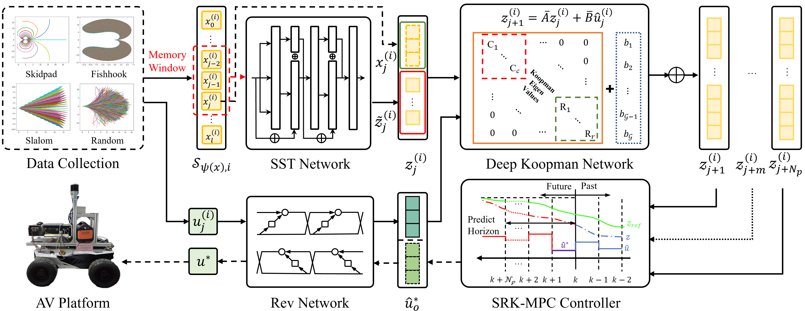
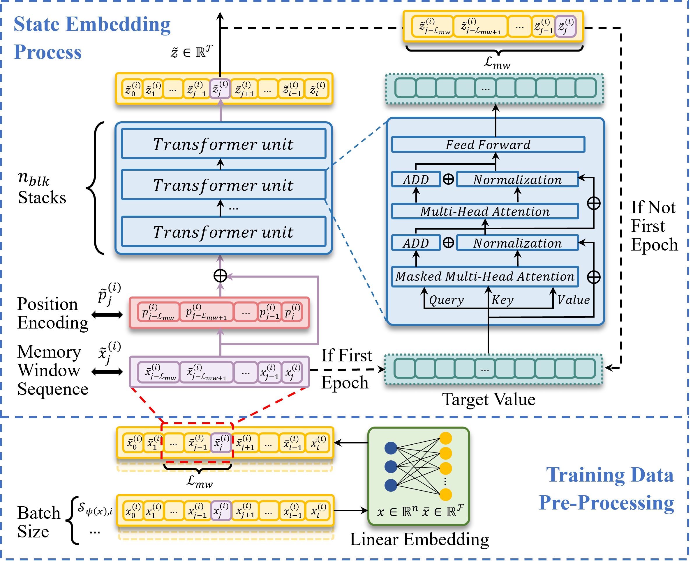
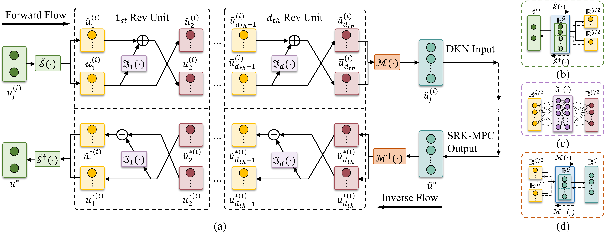

<p align="center">
<h1 align="center">Data-driven Modeling with Deep Koopman Operator for Robust Path Tracking of Autonomous Vehicles</h1>
<h3 class="is-size-4 has-text-weight-bold" style="color: orange;" align="center">
    IEEE Transactions on Industrial Electronics, 2026
</h3>
  <p align="center">
    <a href="https://scholar.google.com/citations?hl=zh-CN&user=G8sNV64AAAAJ" target="_blank"><strong>Zhuoxuan Wang</strong></a>
    ·
    <a href="https://orcid.org/0000-0003-0724-9020" target="_blank"><strong>Shuguo Pan</strong></a>
    ·
    <a href="https://orcid.org/0000-0001-7710-3073" target="_blank"><strong>Kegen Yu</strong></a>
    ·
    <a href="https://orcid.org/0000-0002-4856-2454" target="_blank"><strong>Wang Gao</strong></a>
    ·
    <a href="https://orcid.org/0000-0002-8236-9631" target="_blank"><strong>Zongliang Chen</strong></a>
    <br>
  </p>
</p>

## 📖 Abstract
Inherent nonlinearity poses challenges for path tracking control of autonomous vehicles (AVs). Data-driven modeling with Koopman operator offers a new perspective to enhance path tracking accuracy. Nevertheless, poor embedding quality and significant control reconstruction error still limit the final performance. This paper introduces an innovative data-driven system modeling framework. A Self-Supervised Transformer (SST) with a memory window is proposed for multi-frame state embedding, improving representation and mitigating control phase delay. Besides, a Reversible network (Rev) is developed, where the forward flow is used for control input embedding and the inverse flow is utilized for the lossless reconstruction of optimal control. Furthermore, a quasi-diagonal Deep Koopman Network (DKN) is proposed to effectively approximate linear system matrices in the embedded space. The identified Koopman model is then integrated with a robust MPC, enabling accurate path tracking under noise and disturbances. Extensive simulations across multiple scenarios are conducted to evaluate the proposed method against several benchmarks. Results demonstrate that our framework outperforms principle-based modeling and state-of-the-art data-driven methods, achieving optimal path tracking accuracy, the fastest calculation speed, and the most stable control inputs. Real-world experiments further confirm that our approach delivers accurate path tracking with notable robustness and real-time performance in practical applications.

<p align="center">
  
  <br>
  <strong>Fig.1.</strong> The system architecture.
  <br><br>
    
  
  <br>
  <strong>Fig.2.</strong> Self-Supervised Transformer (SST) structure.
  <br><br>

  
  <br>
  <strong>Fig.3.</strong> Reversible (Rev) network structure. (a) Cascaded homomorphic Rev units. (b) Splitting operator. (c) Multi-layer neural network. (d) Merging operator. </em>
</p>


## 🔗 Paper Link 

## 🧩 Source code
We provide the source code for SST-Rev-DKN training and a pre-trained weight $(\mathcal{L}_{MW}=8)$.

### Prerequisites
Our training environment is based on **Anaconda**. The key dependencies and versions are as follows:
```bash
python == 3.10.1

```
> **Note:** Make sure that the PyTorch version is compatible with your **CUDA** and **Python** versions. 

### Dataset
We provide an example dataset in [GoogleDrive](https://drive.google.com/drive/u/1/folders/1kNL4vJs-EyE-F0nHdsBcYA7ocwuNiJ_0). Please downloading the dataset/create your own dataset and place it under the `SST-Rev-DKN/Data/` directory before training.

### Usage
```bash
# Downloading and Unpackaging the Repository
https://github.com/WangZX-SEU/SST-Rev-DKN

# Navigate to project directory
cd SST-Rev-DKN/Train/

# Key Parameters
"load_mode": 1 for training mode
"X_EMB_SIZE": State embedding dimension
"U_EMB_SIZE": Input embedding dimension
"BATCH_SIZE": Batch size, default is 128
"MEMORY_STEP": Memory window length

# Start Training
run "SST_Rev_DKN.py"
```

## ✒️ Citation
Please cite our paper if you think our work is useful to your scientific research:
```
@article{wang2026sst,
  title={Data-driven Modeling with Deep Koopman Operator for Robust Path Tracking of Autonomous Vehicles},
  author={Zhuoxuan Wang and Shuguo Pan and Kegen Yu and Wang Gao and Zongliang Chen},
  journal={IEEE Trans. Ind. Electron.}, 
}
```
