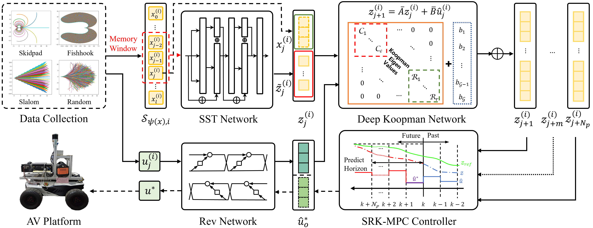

# SST-Rev-DKN
## __Data-driven Modeling with Deep Koopman Operator for Robust Path Tracking of Autonomous Vehicles__

💡 We are working on a data-driven modeling framework with deep Koopman operator for path tracking problem of autonomous vehicles. The paper has been submitted to _IEEE Transactions on Industrial Electronics (TIE)_, and we plan to open-source the code after the paper is accepted.

⚙ System Architecture:

## Paper abstract
Inherent nonlinearity poses challenges for path tracking control of autonomous vehicles (AVs). Data-driven modeling with Koopman operator offers a new perspective to enhance path tracking accuracy. Nevertheless, poor embedding quality and control reconstruction error still limit the final performance. This paper introduces an innovative data-driven system modeling framework, where a Self-Supervised Transformer (SST) is proposed as the state embedding network that employs a memory window for multi-frame sequential state input. Additionally, a Reversible network (Rev) is developed, where the forward flow is used for control input embedding and the inverse flow is utilized for the lossless reconstruction of optimal control. Furthermore, a quasi-diagonal Deep Koopman Network (DKN) is proposed to effectively approximate high-dimensional linear system matrices in the embedded space. The identified model is integrated with a robust model predictive controller (MPC) to ultimately solve the path tracking problem. Extensive simulations under noise and disturbances across multiple scenarios are conducted to evaluate the proposed method against several benchmarks. Results demonstrate that our framework outperforms principle-based modeling and state-of-the-art data-driven methods, achieving optimal path tracking accuracy, the fastest calculation speed, and the most stable control inputs. Real-world experiments further confirm that our approach delivers accurate path tracking with notable robustness and real-time performance in practical applications.

